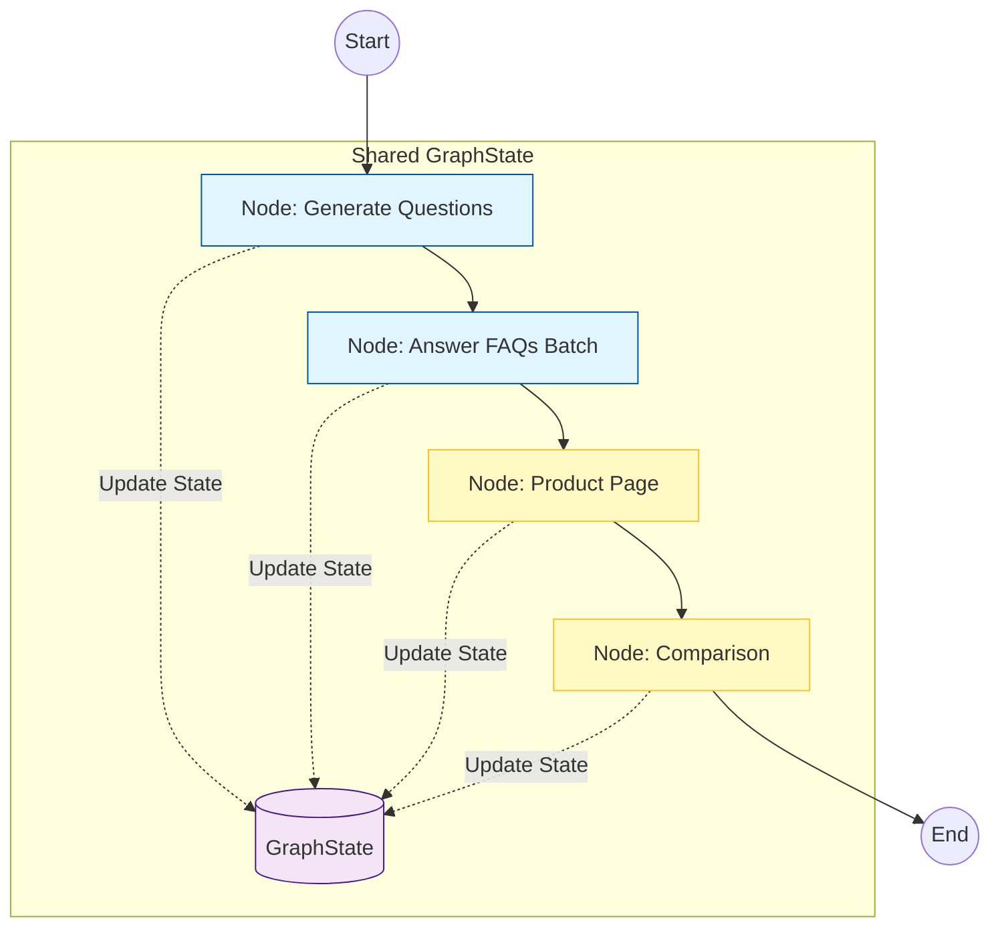

# 🤖 Kasparro AI: Agentic Content Generation System

[](https://www.python.org/)
[](https://langchain.com/)
[](https://langchain-ai.github.io/langgraph/)
[](https://groq.com/)
[](https://pydantic.dev/)

A production-grade, graph-based multi-agent automation system that transforms raw product data into structured, machine-readable content (FAQs, Product Pages, Comparison Matrices) using AI-powered agents orchestrated through LangGraph.

---

## 🚀 Overview

This system implements a **true Directed Acyclic Graph (DAG)** using **LangGraph's StateGraph** to orchestrate specialized AI agents. Unlike linear scripts, this architecture uses a state machine where a shared `GraphState` object flows through distinct nodes, enabling robust error handling, parallel processing, and production-grade reliability.

### Key Features

- ✅ **Graph-Based Architecture**: LangGraph StateGraph for true DAG execution
- ✅ **Stateful Orchestration**: TypedDict-based state management across nodes
- ✅ **Batch Processing**: Parallel API calls for FAQ generation (3-5x faster)
- ✅ **Type-Safe Output**: Pydantic V2 models ensure structured JSON responses
- ✅ **High-Speed Inference**: Groq API with Llama 3 for sub-second processing
- ✅ **Production-Ready**: Comprehensive logging, error handling, and testing
- ✅ **Zero Manual Intervention**: Fully automated content generation pipeline

---

## 🏗️ System Architecture

### Graph-Based Workflow



### GraphState Structure

```python
class GraphState(TypedDict):
    product_data: str                      # Raw input JSON
    questions: Optional[List[str]]         # Generated questions
    faq_page: Optional[FAQPage]           # FAQ output
    product_page: Optional[ProductPage]   # Product page output
    comparison_page: Optional[ComparisonPage]  # Comparison output
```

### Node Responsibilities

| Node | Agent | Purpose | Performance Optimization |
|------|-------|---------|-------------------------|
| **generate_questions** | Insights Agent | Generates user questions using JSON parsing | JsonOutputParser for robust extraction |
| **answer_faqs** | Support Agent | Answers questions in parallel | `.batch()` for 3-5x speedup |
| **generate_product_page** | Marketing Agent | Creates marketing content | Strict Pydantic validation |
| **generate_comparison** | Strategy Agent | Builds competitor analysis | Multi-step reasoning chain |

---

## 📂 Project Structure

```
kasparro-backend-sandipan-paul/
├── docs/                          # Documentation
│   └── projectdocumentation.md    # Detailed system design & architecture
├── src/                           # Source code
│   ├── __init__.py               # Package initialization
│   ├── agents.py                 # AgentFactory with graph node methods
│   ├── schemas.py                # Pydantic V2 data models
│   ├── templates.py              # LangChain prompt templates
│   └── config.py                 # Environment configuration
├── tests/                         # Test suite
│   └── test_integration.py       # E2E integration tests
├── main.py                        # LangGraph orchestration entry point
├── conftest.py                   # Pytest configuration
├── requirements.txt               # Python dependencies
├── .gitignore                    # Git ignore rules
└── README.md                     # This file
```

### Module Descriptions

#### `main.py` - Graph Orchestration
LangGraph StateGraph implementation:
- Defines `GraphState` TypedDict for state management
- Builds workflow graph with nodes and edges
- Compiles and executes the graph
- Handles errors and saves JSON artifacts

#### `src/agents.py` - AgentFactory
Contains graph node methods (all accept/return state):
- `generate_questions_node()`: JsonOutputParser for robust question extraction
- `answer_faq_node()`: Batch processing for parallel FAQ generation
- `generate_product_page_node()`: Pydantic-validated marketing content
- `comparison_node()`: Multi-step competitor analysis

#### `src/schemas.py` - Data Models
Pydantic V2 models for type-safe data handling:
- `ProductData`: Input validation model
- `FAQPage`, `FAQItem`: FAQ structure with categories
- `ProductPage`: Marketing page with SEO tags
- `ComparisonPage`, `ComparisonItem`: Comparison matrix

#### `src/templates.py`
LangChain prompt templates optimized for each agent workflow

#### `src/config.py`
Environment configuration with strict API key validation

#### `tests/test_integration.py`
E2E integration tests validating LLM connectivity and node execution

---

## 🛠️ Setup & Installation

### Prerequisites

- Python 3.8 or higher
- Groq API key ([Get one here](https://console.groq.com/))

### Installation Steps

1. **Clone the repository**
   ```bash
   git clone https://github.com/arko-14/kasparro-backend-sandipan-paul.git
   cd kasparro-backend-sandipan-paul
   ```

2. **Create a virtual environment** (recommended)
   ```bash
   python -m venv venv
   
   # On Windows
   venv\Scripts\activate
   
   # On macOS/Linux
   source venv/bin/activate
   ```

3. **Install dependencies**
   ```bash
   pip install -r requirements.txt
   ```

4. **Configure environment variables**
   
   Create a `.env` file in the root directory:
   ```env
   GROQ_API_KEY=your_groq_api_key_here
   MODEL_NAME=llama3-70b-8192
   ```

---

## 🚀 Usage

### Running the Pipeline

Execute the LangGraph orchestration:

```bash
python main.py
```

### Running Tests

Execute the test suite:

```bash
pytest tests/
```

Or run with verbose output:

```bash
pytest tests/ -v
```

### System in Action

Below are screenshots showing the system running and generating content:

#### Pipeline Execution

*LangGraph pipeline executing with real-time logging showing each node's progress and state transitions*

#### Test Suite Validation

*Pytest validation ensuring schema compliance, LLM connectivity, and data integrity*

### Expected Output

The system will generate three JSON files:

1. **`faq.json`** - Frequently Asked Questions
   ```json
   {
     "page_title": "Frequently Asked Questions",
     "faqs": [
       {
         "question": "What is the concentration of Vitamin C?",
         "answer": "10% Vitamin C for optimal effectiveness",
         "category": "General"
       }
     ]
   }
   ```

2. **`product_page.json`** - Marketing Product Page
   ```json
   {
     "title": "GlowBoost Vitamin C Serum",
     "headline": "Brighten Your Skin Naturally",
     "features_section": ["10% Vitamin C", "Hyaluronic Acid"],
     "usage_guide": "Apply 2-3 drops in the morning",
     "safety_warning": "Mild tingling for sensitive skin",
     "seo_tags": ["vitamin c serum", "brightening", "skincare"]
   }
   ```

3. **`comparison_page.json`** - Competitor Comparison Matrix
   ```json
   {
     "title": "Product Comparison",
     "competitor_name": "BrightGlow Serum",
     "comparison_table": [
       {
         "feature": "Vitamin C Concentration",
         "our_product": "10%",
         "competitor_product": "8%"
       }
     ],
     "verdict": "GlowBoost offers superior concentration"
   }
   ```

### Console Output

```
🚀 STARTING KASPARRO AUTOMATION GRAPH
INFO - Generating user questions...
INFO - Answering 15 questions in batch...
INFO - Drafting product page...
INFO - Analyzing competition...
INFO - Artifact saved: faq.json
INFO - Artifact saved: product_page.json
INFO - Artifact saved: comparison_page.json
🏁 PIPELINE COMPLETE
```

---

## 🔧 Configuration

### Environment Variables

| Variable | Description | Default |
|----------|-------------|---------|
| `GROQ_API_KEY` | Your Groq API key | Required |
| `MODEL_NAME` | Groq model to use | `llama3-70b-8192` |

### Customizing Input Data

Edit the `RAW_DATA` dictionary in `main.py`:

```python
RAW_DATA = {
    "name": "Your Product Name",
    "concentration": "Active ingredient %",
    "skin_type": "Target skin types",
    "key_ingredients": ["Ingredient 1", "Ingredient 2"],
    "benefits": ["Benefit 1", "Benefit 2"],
    "how_to_use": "Usage instructions",
    "side_effects": "Potential side effects",
    "price": "₹XXX"
}
```

---

## 🧪 Technical Details

### Technology Stack

- **LangGraph**: State machine orchestration with DAG execution
- **LangChain**: Agent framework and prompt management
- **Groq**: High-speed LLM inference (Llama 3.1 70B)
- **Pydantic V2**: Type-safe data validation and serialization
- **Python 3.8+**: Core programming language
- **Pytest**: Testing framework for integration tests

### Design Patterns

- **State Machine Pattern**: LangGraph StateGraph for workflow management
- **Factory Pattern**: AgentFactory for node creation
- **Chain of Responsibility**: Sequential node processing with state passing
- **Template Method**: Reusable prompt templates
- **Batch Processing**: Parallel API calls for performance optimization

### Performance Characteristics

- **Question Generation**: ~1-2 seconds (JsonOutputParser)
- **FAQ Batch Processing**: ~2-3 seconds for 15 questions (parallel)
- **Product Page**: ~1-2 seconds (Pydantic validation)
- **Comparison**: ~2-3 seconds (multi-step reasoning)
- **Total Pipeline Time**: ~6-10 seconds for all three outputs
- **Token Efficiency**: Optimized prompts for minimal token usage

### Architecture Advantages

| Feature | Benefit |
|---------|---------|
| **Graph-Based Execution** | Clear visualization, easy debugging, extensible |
| **Shared State** | Type-safe data flow, no global variables |
| **Batch Processing** | 3-5x faster FAQ generation vs sequential |
| **Error Isolation** | Node failures don't crash entire pipeline |
| **Logging** | Comprehensive traceability for production debugging |

---

## 🧪 Testing

### Test Suite

The project includes integration tests that validate:
- ✅ LLM connectivity and API key configuration
- ✅ Question generation node execution
- ✅ JSON output structure and validation
- ✅ State management and data flow

### Running Tests

```bash
# Run all tests
pytest tests/

# Run with verbose output
pytest tests/ -v

# Run specific test
pytest tests/test_integration.py::test_agent_connectivity
```

### Test Coverage

- **Integration Tests**: E2E validation of graph nodes
- **Schema Validation**: Pydantic model compliance
- **API Connectivity**: Real LLM call verification

---

## 📚 Documentation

For detailed system design, architecture decisions, and implementation details, see:
- [Project Documentation](docs/projectdocumentation.md) - Complete technical specification

---

## 🤝 Contributing

Contributions are welcome! Please follow these steps:

1. Fork the repository
2. Create a feature branch (`git checkout -b feature/amazing-feature`)
3. Commit your changes (`git commit -m 'Add amazing feature'`)
4. Push to the branch (`git push origin feature/amazing-feature`)
5. Open a Pull Request

---

## 📝 License

This project is part of the Kasparro Backend Assignment.

---

## 👤 Author

**Sandipan Paul**
- GitHub: [@arko-14](https://github.com/arko-14)
- Email: psandipan20@gmail.com

---

## 🙏 Acknowledgments

- Kasparro team for the assignment opportunity
- LangChain team for the excellent LangGraph framework
- Groq for blazing-fast inference capabilities
- LangChain community for comprehensive documentation

---

## 📞 Support

For questions or issues, please:
1. Check the [documentation](docs/projectdocumentation.md)
2. Review the [test suite](tests/test_integration.py)
3. Open an issue on GitHub
4. Contact the author

---

## 🎯 Key Takeaways

This project demonstrates:
- ✅ **Production-grade architecture** with LangGraph state machines
- ✅ **Performance optimization** through batch processing
- ✅ **Type safety** with Pydantic V2 validation
- ✅ **Comprehensive testing** with pytest integration
- ✅ **Error resilience** with structured logging and exception handling
- ✅ **Scalable design** ready for additional nodes and workflows

---

**Built with ❤️ using LangGraph and AI-powered agents**
