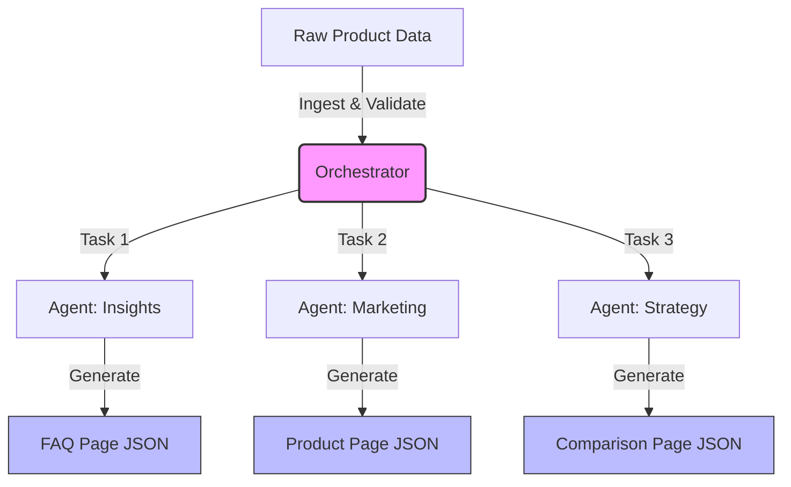

# 🤖 Kasparro AI: Agentic Content Generation System

[](https://www.python.org/)
[](https://langchain.com/)
[](https://groq.com/)
[](https://pydantic.dev/)

A modular, multi-agent automation system designed to transform raw product data into structured, machine-readable content (FAQs, Product Pages, Comparison Matrices) using AI-powered agents.

---

## 🚀 Overview

This system utilizes a **Directed Acyclic Graph (DAG)** of specialized agents to autonomously process skincare product data. It features strict **JSON output enforcement** via Pydantic V2 and uses **Groq (Llama 3)** for high-speed inference.

### Key Features

- ✅ **Multi-Agent Orchestration**: Three specialized agents working in parallel
- ✅ **Type-Safe Output**: Pydantic V2 models ensure structured JSON responses
- ✅ **High-Speed Inference**: Groq API with Llama 3 for fast processing
- ✅ **Modular Architecture**: Clean separation of concerns with reusable components
- ✅ **Zero Manual Intervention**: Fully automated content generation pipeline

---

## 🏗️ System Architecture

### Agent Workflow



### Agent Responsibilities

| Agent | Purpose | Output |
|-------|---------|--------|
| **Insights Agent** | Generates user questions and answers them | `faq.json` |
| **Marketing Agent** | Transforms technical data into marketing content | `product_page.json` |
| **Strategy Agent** | Creates competitor analysis and comparison matrix | `comparison_page.json` |

---

## 📂 Project Structure

```
kasparro-backend-sandipan-paul/
├── docs/                          # Documentation
│   └── projectdocumentation.md    # Detailed system design
├── src/                           # Source code
│   ├── __init__.py               # Package initialization
│   ├── agents.py                 # Agent definitions & orchestration logic
│   ├── schemas.py                # Pydantic data models
│   ├── templates.py              # Prompt engineering templates
│   └── config.py                 # Environment configuration
├── main.py                        # Entry point & orchestration
├── requirements.txt               # Python dependencies
├── .gitignore                    # Git ignore rules
└── README.md                     # This file
```

### Module Descriptions

#### `src/agents.py`
Contains the `AgentOrchestrator` class with three static methods:
- `generate_faqs()`: Two-step FAQ generation (questions → answers)
- `generate_product_page()`: Marketing content transformation
- `generate_comparison()`: Competitor analysis and comparison matrix

#### `src/schemas.py`
Pydantic V2 models for type-safe data handling:
- `ProductData`: Input data model
- `FAQPage`, `FAQItem`: FAQ structure
- `ProductPage`: Marketing page structure
- `ComparisonPage`, `ComparisonItem`: Comparison matrix structure

#### `src/templates.py`
LangChain prompt templates for each agent workflow

#### `src/config.py`
Environment configuration and API key management

---

## 🛠️ Setup & Installation

### Prerequisites

- Python 3.8 or higher
- Groq API key ([Get one here](https://console.groq.com/))

### Installation Steps

1. **Clone the repository**
   ```bash
   git clone https://github.com/arko-14/kasparro-backend-sandipan-paul.git
   cd kasparro-backend-sandipan-paul
   ```

2. **Create a virtual environment** (recommended)
   ```bash
   python -m venv venv
   
   # On Windows
   venv\Scripts\activate
   
   # On macOS/Linux
   source venv/bin/activate
   ```

3. **Install dependencies**
   ```bash
   pip install -r requirements.txt
   ```

4. **Configure environment variables**
   
   Create a `.env` file in the root directory:
   ```env
   GROQ_API_KEY=your_groq_api_key_here
   MODEL_NAME=llama3-70b-8192
   ```

---

## 🚀 Usage

### Running the Pipeline

Execute the main orchestration script:

```bash
python main.py
```

### System in Action

Below are screenshots showing the system running and generating content:

#### Pipeline Execution

*The agentic pipeline executing with real-time logging showing each node's progress*

#### Test Suite Validation

*Pytest validation ensuring schema compliance and data integrity*

### Expected Output

The system will generate three JSON files:

1. **`faq.json`** - Frequently Asked Questions
   ```json
   {
     "page_title": "Frequently Asked Questions",
     "faqs": [
       {
         "question": "What is the concentration of Vitamin C?",
         "answer": "10% Vitamin C for optimal effectiveness",
         "category": "General"
       }
     ]
   }
   ```

2. **`product_page.json`** - Marketing Product Page
   ```json
   {
     "title": "GlowBoost Vitamin C Serum",
     "headline": "Brighten Your Skin Naturally",
     "features_section": ["10% Vitamin C", "Hyaluronic Acid"],
     "usage_guide": "Apply 2-3 drops in the morning",
     "safety_warning": "Mild tingling for sensitive skin",
     "seo_tags": ["vitamin c serum", "brightening", "skincare"]
   }
   ```

3. **`comparison_page.json`** - Competitor Comparison Matrix
   ```json
   {
     "title": "Product Comparison",
     "competitor_name": "BrightGlow Serum",
     "comparison_table": [
       {
         "feature": "Vitamin C Concentration",
         "our_product": "10%",
         "competitor_product": "8%"
       }
     ],
     "verdict": "GlowBoost offers superior concentration"
   }
   ```

### Console Output

```
AUTOMATION SYSTEM STARTING...

✅ Data Ingested: GlowBoost Vitamin C Serum

--- NODE 1: FAQ GENERATION ---
   -> [Agent: Insight] Generating questions...
   -> [Agent: Support] Answering 5 questions...
✅ output saved: faq.json

--- NODE 2: PRODUCT PAGE GENERATION ---
   -> [Agent: Marketing] Drafting product page...
✅ output saved: product_page.json

--- NODE 3: COMPARISON GENERATION ---
   -> [Agent: Competitor Analyst] Creating fictional competitor...
   -> [Agent: Strategist] Building comparison matrix...
✅ output saved: comparison_page.json
```

---

## 🔧 Configuration

### Environment Variables

| Variable | Description | Default |
|----------|-------------|---------|
| `GROQ_API_KEY` | Your Groq API key | Required |
| `MODEL_NAME` | Groq model to use | `llama3-70b-8192` |

### Customizing Input Data

Edit the `RAW_DATA` dictionary in `main.py`:

```python
RAW_DATA = {
    "name": "Your Product Name",
    "concentration": "Active ingredient %",
    "skin_type": "Target skin types",
    "key_ingredients": ["Ingredient 1", "Ingredient 2"],
    "benefits": ["Benefit 1", "Benefit 2"],
    "how_to_use": "Usage instructions",
    "side_effects": "Potential side effects",
    "price": "₹XXX"
}
```

---

## 🧪 Technical Details

### Technology Stack

- **LangChain**: Agent orchestration and prompt management
- **Groq**: High-speed LLM inference (Llama 3)
- **Pydantic V2**: Type-safe data validation and serialization
- **Python 3.8+**: Core programming language

### Design Patterns

- **Hub-and-Spoke Orchestration**: Central orchestrator managing specialized agents
- **Chain of Responsibility**: Sequential processing within agents
- **Template Method**: Reusable prompt templates

### Performance Characteristics

- **Inference Speed**: ~2-3 seconds per agent (Groq)
- **Total Pipeline Time**: ~6-10 seconds for all three outputs
- **Token Efficiency**: Optimized prompts for minimal token usage

---

## 📚 Documentation

For detailed system design and architecture, see:
- [Project Documentation](docs/projectdocumentation.md)

---

## 🤝 Contributing

Contributions are welcome! Please follow these steps:

1. Fork the repository
2. Create a feature branch (`git checkout -b feature/amazing-feature`)
3. Commit your changes (`git commit -m 'Add amazing feature'`)
4. Push to the branch (`git push origin feature/amazing-feature`)
5. Open a Pull Request

---

## 📝 License

This project is part of the Kasparro Backend Assignment.

---

## 👤 Author

**Sandipan Paul**
- GitHub: [@arko-14](https://github.com/arko-14)
- Email: psandipan20@gmail.com

---

## 🙏 Acknowledgments

- Kasparro team for the assignment opportunity
- Groq for high-speed inference capabilities
- LangChain community for excellent documentation

---

## 📞 Support

For questions or issues, please:
1. Check the [documentation](docs/projectdocumentation.md)
2. Open an issue on GitHub
3. Contact the author

---

**Built with ❤️ using AI-powered agents**
