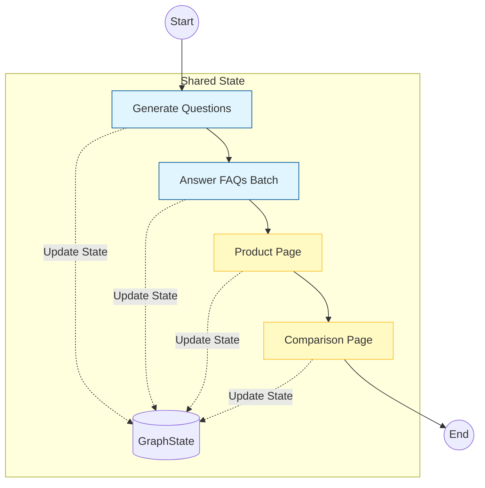

# Project Documentation: Kasparro Agentic Content System

## 1. Problem Statement
Design a modular, automated agentic system to transform raw product data (GlowBoost Serum) into structured content formats (FAQ, Product Page, Comparison) without manual intervention, ensuring production-grade robustness and scalability.

## 2. Solution Overview
I implemented a **Graph-Based Agentic Architecture** using **LangGraph** (`StateGraph`). Unlike linear scripts, this system models the workflow as a state machine where a shared state object is passed between distinct nodes.

**Key Technical Decisions:**
* **Orchestration:** **LangGraph** for true DAG (Directed Acyclic Graph) execution.
* **Inference:** **Groq (Llama-3)** for high-performance, low-latency generation.
* **Validation:** **Pydantic V2** for strict schema enforcement.
* **Robustness:** Implemented structured **Logging**, **Batch Processing**, and Unit Tests.

## 3. Scopes & Assumptions
* **Scope:** The system is optimized for the provided "GlowBoost" dataset but is designed with a schema-first approach to handle any skincare product with similar attributes.
* **Assumption (Competitor):** The "Competitor" product is dynamically hallucinated by the LLM based on market context to simulate a realistic comparison scenario.
* **Assumption (Output):** All downstream systems expect strict JSON; therefore, the pipeline prioritizes schema validity over creative flair if a conflict arises.

## 4. System Design (Architecture)

The system is designed around a central `GraphState` that maintains the context across the lifecycle.

### The Graph State
```python
class GraphState(TypedDict):
    product_data: str          # Raw Input
    questions: List[str]       # Intermediate Artifact
    faq_page: FAQPage          # Final Output A
    product_page: ProductPage  # Final Output B
    comparison_page: ComparisonPage # Final Output C
```

### The Nodes (Agents)

#### Node: Generate Questions (generate_questions_node)
* Uses `JsonOutputParser` to robustly extract a list of questions.
* Improvement: Removed truncation logic to ensure the full set of 15+ questions is processed.

#### Node: Answer FAQs (answer_faq_node)
* Performance: Uses `.batch()` to process all questions in parallel API calls rather than a sequential loop.

#### Node: Product Page (product_page_node)
* Drafts marketing copy with strict adherence to the `ProductPage` schema.

#### Node: Comparison (comparison_node)
* Multi-step reasoning: First hallucinates a competitor, then generates a comparison matrix.

### Automation Graph Diagram


## 5. Reliability & Testing
To address production readiness, several layers of robustness were added:

* **Structured Logging:** Replaced print statements with Python's `logging` module for traceability.
* **Error Handling:** All Agent Nodes are wrapped in try-except blocks to prevent graph crashes.
* **Unit Testing:** Added a `tests/` suite using `pytest` to verify Pydantic schemas and data validation rules.
* **Configuration:** Strict enforcement of Environment Variables (`GROQ_API_KEY`) prevents startup in invalid states.

## 6. Output Structure
The pipeline produces three standardized JSON artifacts:

* **faq.json:** Contains categorized Q&A pairs.
* **product_page.json:** Marketing copy including headlines and benefits.
* **comparison_page.json:** A competitive analysis matrix against a generated competitor.
